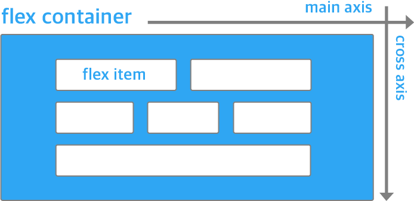
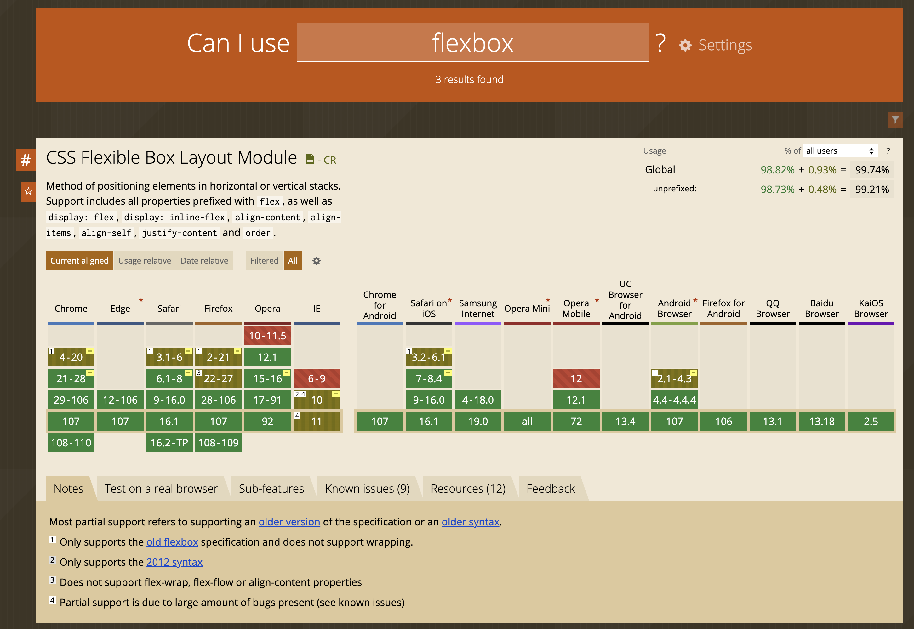
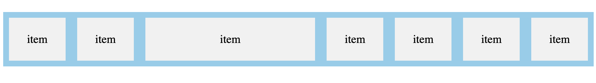
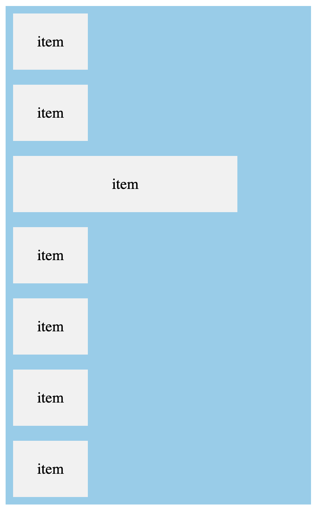
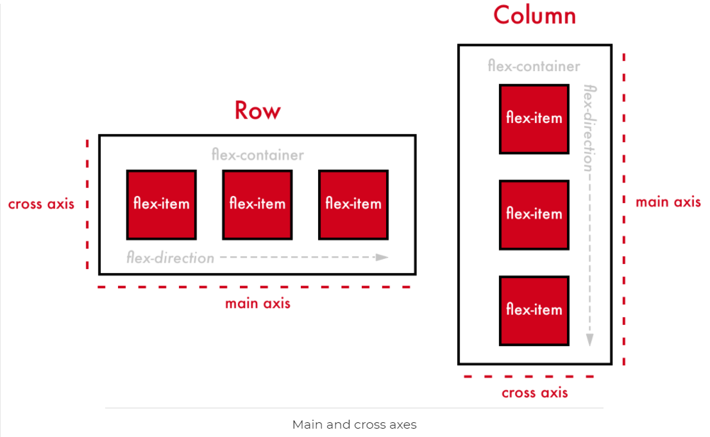
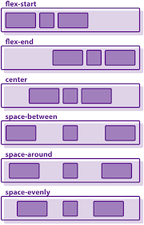
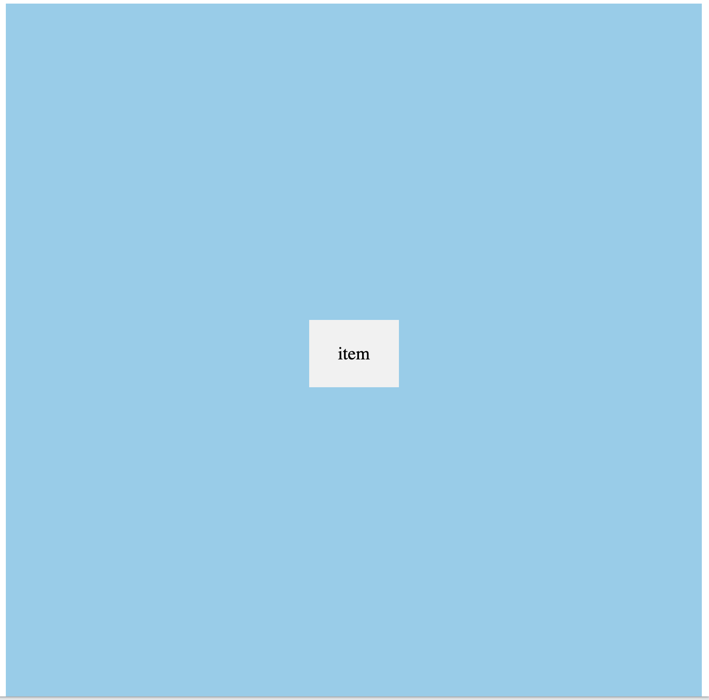
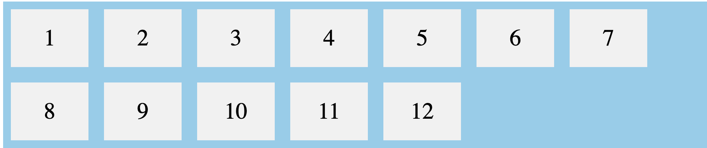
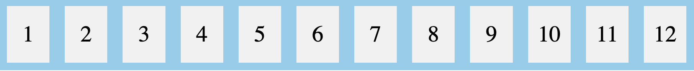

# flexBox
레이아웃과 관련된 속성중에서 display : flex 의 개념 정리 글입니다.

플렉스 박스는 기존 CSS 레이아웃 사용의 불편한 부분을 개선하기 위해 등장했습니다.  
플렉스 박스는 크게 컨테이너(__flex container__)와 아이템(__flex item__)으로 구성됩니다.  
display: flex 를 하면 엘리먼트가 플렉스 컨테이너(flex container)가 되며 내부에 여러 개의 엘리먼트를 포함할 수 있습니다.
이때 포함되는 엘리먼트들이 바로 플렉스박스의 아이템(flex item) 입니다.




<br/>
<br/>
<br/>
<br/>

### flexbox 호환성  

  

:::tip  
flexBox 의 호환성은 99%의 높은 호환성을 보이지만 IE10이나 이하에서는 지원하지 않습니다.
:::

<br/>
<br/>
<br/>
<br/>

### display: flex - 엘리먼트를 flex container 로 만들기
아이템들이 들어있는 외부 요소에다가 적용합니다. 
```html{3}
<style>
  .flex-container {
    display: flex; /* flex container 로 만들어지며 내부 엘리먼트들은 flex item 이 됩니다. */
    background-color: skyblue;
  }
  .flex-container > div {
    background-color: #f1f1f1;
    width: 100px;
    margin: 10px;
    text-align: center;
    line-height: 75px;
    font-size: 20px;
  }
  .flex-container > div:nth-child(3) {
    width: 300px;
  }
</style>

<div class="flex-container">
  <div>item</div>
  <div>item</div>
  <div>item</div>  
  <div>item</div>
  <div>item</div>
  <div>item</div>
  <div>item</div>
</div>
```
  
아이템들의 기본 정렬방향이 좌 -> 우이기 때문에 가로로 나란히 정렬되었습니다.

<br/>
<br/>
<br/>

### flex-direction 속성으로 flex item 들의 정렬 순서나 방향 변경하기
기본 정렬 방향을 바꿀수도 있습니다. 세로방향으로 정렬을 원하면 flex-direction 속성을 이용하여
축을 바꿀 수 있습니다. 

- row : 행(row)을 따라 가로 순으로 왼쪽부터 배치. 기본값.
- column : 열(column)을 따라 세로 순서대로 위쪽부터 배치
- row-reverse : 행(row)의 역방향 (reverse) 으로 오른쪽부터 배치
- column-reverse : 열(column)의 역방향 (reverse) 으로 아래쪽부터 배치

```css{3}
.flex-container {
  display: flex;
  flex-direction: column;  /* row | row-reverse | column-reverse; */
  ...
}
flex-container > div {
  ...
}
```
  

flex-direction 을 column 이니 기본값 (row) 가로정렬이 아닌 열(column)을 따라 세로 순서대로 위쪽부터 배치됩니다.


#### axis 를 결정하는 flex-direction

flex 의 축(axis) 를 바꿔주고 싶으면 flex-direction 을 적용해주면 되는데
flex-direction 에서 지정된 방향 축(axis)을 __main axis__ 라고 부르고
main axis 를 가로지르는 방향의 축을 __cross axis__ 라고 부릅니다.
```css
.flex-container {
  display: flex;    /* inline 요소에는 inline-fex */
  flex-direction: row;     /* 기본값인 row */ 
  justify-content: center; /* main axis 는 가로방향 좌 -> 우 */ 
  align-items: center;     /* cross axis 는 세로방향 상 -> 하 */
}
```
만약 flex-direction 이 column 이라면 justify-content 와 align-items 의 axis 는 변하게 됩니다.  
justify-content 의 main axis 는 세로 상->하가 되고 align-items 의 cross-axis 는 가로 좌->우가 될겁니다.



<br/>
<br/>
<br/>


### justify-content ( main axis )
```css
justify-content: flex-start | center | flex-end | space-between | space-around;
```
- flex-start : main axis 의 시작 지점으로 아이템 정렬
- center : cross axis 중앙으로 아이템을 정렬
- flex-end: main axis 의 끝 지점으로 아이템을 정렬
- space-between : main axis 기준으로 첫 아이템은 시작 지점에, 마지막 아이템은 끝 지점에, 나머지 중간에 있는 아이템들은 사이의 가격이 일정하도록 정렬됩니다.


### align-items ( cross axis )
```css
align-items: stretch | flex-start | center | flex-end | space-between | space-around | baseline;
```
- flex-start: cross axis 의 시작 지점으로 아이템 정렬. 
- center : cross axis 중앙으로 아이템 정렬
- flex-end : cross axis 의 끝 지점으로 아이템을 정렬




<br/>
<br/>
<br/>
<br/>
<br/>
<br/>

실무에서 주로 적용하던 스타일링입니다.
가로, 세로 기준으로 center 정렬이 가장 많이 사용됩니다. 
```html{3-8}
<style>
.flex-container {
  display: flex;
  flex-direction: column;
  justify-content: center;
  align-items: center;
  height: 100vh;
  overflow: hidden;
  background-color: skyblue;
}
.flex-container > div.wrapper {
  background-color: #f1f1f1;
  width: 100px;
  margin: 10px;
  text-align: center;
  line-height: 75px;
  font-size: 20px;
}
</style>
<div class="flex-container">
  <div class="wrapper">item</div>
</div>
```
   


<br/>
<br/>

또한 대개의 요소들은 중앙정렬을 하니 flex 클래스명을 재사용하기도 합니다.
```html

.flex {
    display: flex;
    align-items: center;
    justify-content: center;
}

<body class="flex">
	<div class="container flex">
		<div class="month flex">
          ...
		</div>
		<div class="weekdays flex">
          ...
		</div>
		<div class="days flex">
          ...
		</div>
	</div>
</body>

```

### flex-wrap 속성으로 카드 UI 구성하기

```html{4}
<style>
.flex-container {
  display: flex;
  flex-wrap: wrap;
  background-color: skyblue;
}

.flex-container > div {
  background-color: #f1f1f1;
  width: 100px;
  margin: 10px;
  text-align: center;
  line-height: 75px;
  font-size: 30px;
}
</style>
</head>
<body>

<div class="flex-container">
  <div>1</div>
  <div>2</div>
  <div>3</div>  
  <div>4</div>
  <div>5</div>
  <div>6</div>  
  <div>7</div>
  <div>8</div>
  <div>9</div>  
  <div>10</div>
  <div>11</div>
  <div>12</div>  
</div>
```


<br/>
<br/>

브라우저의 너비만큼 자동으로 정렬도 됩니다. 만약 flex-wrap 속성을 nowrap 으로 변경하면 
아이템들은 알아서 사이즈 조절을 하여, 한 row 를 채웁니다.

```css{3}
.flex-container {
  display: flex;
  flex-wrap: nowrap;
  background-color: skyblue;
}
...
...
```



<br/>
<br/>
<br/>
<br/>

[웹]


[앱]


출처  
[https://www.alibabacloud.com/blog/details-on-flexbox-layout_598139](https://www.alibabacloud.com/blog/details-on-flexbox-layout_598139)  
[https://superfelix.tistory.com/630](https://superfelix.tistory.com/630)  
[https://www.w3schools.com/css/css3_flexbox.asp](https://www.w3schools.com/css/css3_flexbox.asp)  
